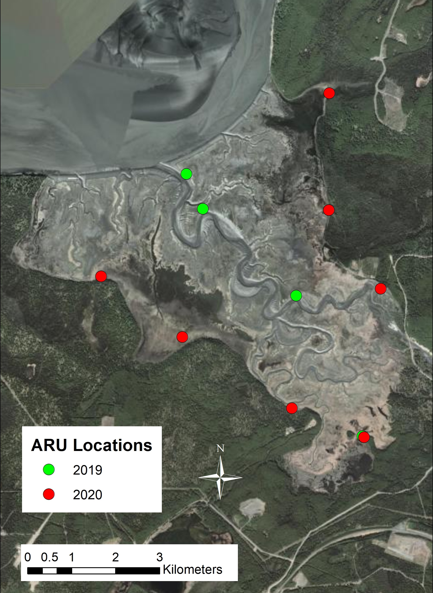
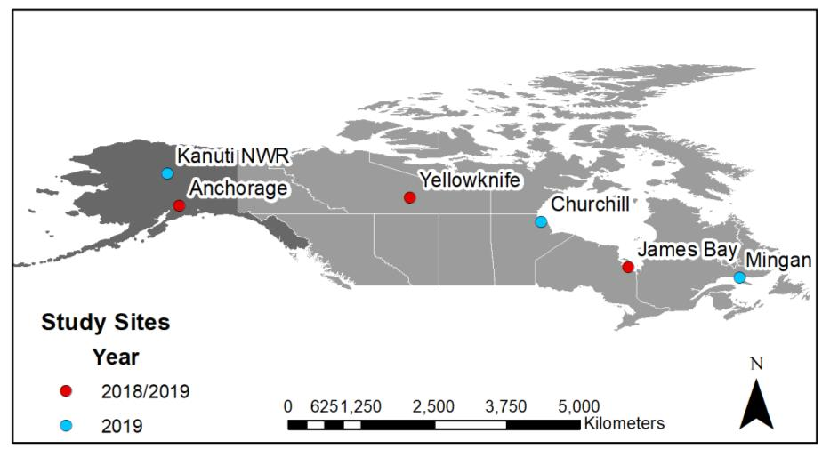

\newpage
\tableofcontents
\listoffigures
\listoftables
\newpage

```{r setup, include=FALSE}
knitr::opts_chunk$set(echo = TRUE)
```

## Acronyms and Abbreviations
ADF&G

:   Alaska Department of Fish and Game

ARU

:   Automated Recording Unit

BBA

:   Breeding Bird Atlas

BBS

:   Breeding Bird Survey

BCR

:   Bird Conservation Region

BPIF

:   Boreal Partners in Flight

CEIEC

:   Natural Recources Element, Conservation and Compliance

CES

:   Civil Engineer Squadron

DoD

:   Department of Defense

DOI

:   Department of Interior

ERF

:   Eagle River Flats

GPS

:   Global Positioning System

JBER

:   Joint Base Elmendorf-Richardson

MBM

:   Migratory Bird Management (U.S. Fish and Wildlife Service)

MWH

:   MWH Americas, Inc.

NWI

:   National Wetlands Inventory 

PIF

:   Partners in Flight

SOSC

:   Species of Special Concern

UAA

:   University of Alaska Anchorage

USDA

:   U.S. Department of Agriculture

USFWS

:   U.S. Fish and Wildlife Service

USGS

:   U.S. Geological Survey


\newpage

## Executive Summary
Many of North America's most rapidly declining avifauna breed in the boreal ecosystems of Alaska. Joint Base Elmendorf-Richardson (JBER) located in Anchorage, Alaska, provides critical nesting habitat for five avian Species of Special Concern (SOSC): Solitary Sandpiper *Tringa solitaria*, Lesser Yellowlegs *Tringa flavipes*, Olive-sided Flycatcher *Contopus cooperi*, Rusty Blackbird *Euphagus carolinus* and Blackpoll Warbler *Setophaga striata*. Joint Base Elmendorf-Richardson derived the Species of Special Concern list from the Birds of Conservation Concern (USFWS 2008) and the Department of Defense Mission-Sensitive Priority Bird Species (DoD PIF 2015) lists. Department of Defense Partners in Flight recognizes both Olive-sided Flycatcher and Rusty Blackbirds as species of concern, while Solitary Sandpiper, Lesser Yellowlegs and Blackpoll Warbler are listed as species of high conservation need. Additionally in Alaska, Short-billed Dowitcher *Limnodromus griseus* and Greater Yellowlegs *Tringa melanoleuca* breed almost exclusively in Southcentral Alaska and are known to nest in boreal wetland habitat within the boundaries of Joint Base Elmendorf-Richardson. \par Beginning in 2007, the U.S. Fish and Wildlife Service and Department of Defense initiated a collaborative effort to fill knowledge gaps on Species of Special Concern and boreal wetland breeders on Joint Base Elmendorf-Richardson. Primary objectives include: (1) develop and implement a survey program to determine relative abundance, distribution, and habitat associations of Species of Special Concern and boreal breeders; (2) implement avian surveys to assist with Environmental Impact Statement (EIS) reports, (3) capture, individually mark, and monitor Species of Special Concern and boreal breeders to estimate annual adult survival and breeding site fidelity; and (4) deploy tracking devices on Species of Special Concern and boreal breeders to identify habitat selection on Joint Base Elmendorf-Richardson, annual migratory routes, and important stopover and wintering locations. Since 2016, four boreal wetland surveys, 1 montane survey, and two Eagle River Flats point count surveys have been completed. Additionally, we deployed tracking devices on Solitary Sandpiper, Lesser Yellowlegs, Greater Yellowlegs, Olive-sided Flycatcher, Rusty Blackbird, and Tree Swallow.\par The success of these survey and tracking studies compliment multiple-state and continent-wide efforts to investigate factors contributing to long-term Species of Special Concern population declines. Species abundance estimates and information collected on important habitats and nesting sites is consistent with the military's environmental stewardship goals as follows: (1) conduct inter-service and international readiness training while meeting the natural resource management goals of Joint Base Elmendorf-Richardson, (2) inform the Bird/Wildlife Aircraft Strike Hazard Program to improve the U.S. Bird Avoidance Model for the safety of both military and civilian aircraft, (3) inform the habitat and species recovery programs throughout the U.S. and Canada, (4) assist with the national and international efforts to understand the limiting factors driving avian population declines, and (5) model physical and genetic linkages between breeding and non-breeding locations to identify connectivity of breeding avian populations on DoD lands in Alaska to non-breeding populations internationally.

\newpage

## Introduction
The Sikes Act Section 101(a) (16 U.S. Code 670(a)) requires that Department of Defense installations prepare an Integrated Natural Resource Management Plan (INRMP) to conserve and restore natural resources on military installations, and ensure all military activities align with environmental stewardship, laws and regulations, and the mission of the Department of Defense (DoD). The United States Air Force (USAF) environmental program developed through the INRMP advocates for natural resource stewardship, including the conservation of avian communities and habitats. A plan recently outlined by the DoD, *Strategic Plan for Bird Conservation and Management on Department of Defense Lands* (DoD 2014) aims to manage and conserve resident and migratory bird species and their habitats on DoD lands, while maintaining mission readiness resources for military training purposes. \par Avian species associated with boreal wetlands are among the continents most rapidly declining avifauna. Of particular concern are the precipitous range-wide declines since 1970 of Blackpoll Warblers (-4.5% / yr.), Rusty Blackbirds (-3.5% / yr.), Olive-sided Flycatchers (-3.0% / yr.), Lesser Yellowlegs (-2.2% / yr.), and Solitary Sandpipers (0.01% / yr.; Sauer et al. 2017). Between 199 - 2015 in the Northwestern Interior Forest Bird Conservation Region (BCR) of Alaska, the same species experienced population declines or minimal growth; Blackpoll Warblers (-2.3% / yr.), Rusty Blackbirds (0.4% / yr.), Olive-sided Flycatchers (-1.2% / yr.), Lesser Yellowlegs (- 2.0% / yr.), and Solitary Sandpipers (-1.3% / yr.; Handel and Sauer 2017). These species, designated as Species of Special Concern (SOSC), have lost an estimated 50 - 90% of their populations and most are projected to lose an additional 50% within the next 15 - 25 years (Rosenberg et al. 2019, Rosenberg et al. 2016).\par State and continental conservation planning efforts have emphasized the need to determine demographic deficits, key habitats, linkages between breeding and wintering populations, contaminant burdens, and the incidence of disease among SOSC populations (Alaska Shorebird Group 2008, DoD Partners in Flight [PIF] 2015, Alaska Department of Fish and Game 2015, U.S. Shorebird Conservation Plan Partnership 2016, Boreal Partners in Flight 2017). Such information is urgently required to identify the mechanisms driving declines, help direct conservation and management of important areas and habitats, and ultimately help reverse avian population declines before more costly recovery efforts are required. \par Department of Defense has a long history of supporting bird studies in Alaska, with the overarching goal to maintain the health of migratory and resident bird populations and their supporting habitats to allow for flexibility in military operations (DoD PIF 2015).  Efforts to characterize the Joint Base Elmendorf-Richardson (JBER) avifauna were first initiated by U.S. Fish and Wildlife Service (USFWS) in 1994 with the establishment of an intensive inventory and monitoring effort that consisted of North American Breeding Bird Surveys [link](https://www.pwrc.usgs.gov/bbs/.com), Breeding Bird Atlas [link](https://www.pwrc.usgs.gov/bba/index.cfm?fa=bba.Bbahome.com), and Monitoring Avian Productivity and Survivorship [link](www.birdpop.org/pages/maps.php) programs (Browne and Andres 2002, Andres 2005). \par In 2007, the Alaska Department of Fish and Game (ADF&G) and USFWS began a comprehensive research effort to describe breeding ecology and reproductive rates of Rusty Blackbirds on JBER. Several publications resulted from this effort, which highlighted the importance of DoD lands in Alaska for Rusty Blackbirds (Matsuoka et al. 2010a, Matsuoka et al. 2010b). MWH Americas Inc. (MWH) was contracted by 673d Civil Engineering Squadron/Civil Engineering Installation Environmental Conservation (673d CES/CEIEC) to build upon these efforts by expanding the extent of surveys to include several additional SOSC primarily associated with boreal wetlands. With input from USFWS, MWH surveyed wetlands during 2014 - 2015 to further establish baseline information on the abundance and distribution of wetland-associated SOSC (MWH Americas, Inc. 2015). \par Since 2015, a collaborative effort between ADF&G, DoD, and USFWS continues to fill important information gaps for five SOSC on JBER: Solitary Sandpiper, Lesser Yellowlegs, Olive-sided Flycatcher, Rusty Blackbird, and Blackpoll Warbler. Primary objectives include: (1) develop and implement a robust survey and monitoring program to determine relative abundance and critical nesting habitat for wetland-associated SOSC, (2) implement avian surveys to assist with Environmental Impact Statement (EIS) reports, (3) capture and individually band SOSC as a means to estimate apparent adult survival, and (4) attach small tracking devices to SOSC, as well as Greater Yellowlegs and Short-billed Dowitcher, to determine local habitat selection on JBER and migratory connectivity between breeding and non-breeding locations. In addition, we collect occupancy data on seven focal species with suspected or known population declines: Common Loon, Red-throated Loon, Red-necked Grebe, Lesser Scaup, Greater Yellowlegs, Short-billed Dowitcher, Long-billed Dowitcher, and Wilson's Snipe.  \par Results from monitoring and tracking efforts complement the Birds and Bogs program, a citizen science program organized by Audubon Alaska and the University of Alaska Anchorage (UAA) that aims to document the distribution and abundance of wetland-associated boreal bird species in Anchorage, JBER, and the Matanuska-Susitna Valley (Mat-Su). A current UAA graduate student will use the data collected by both studies to examine habitat use patterns among wetlands within urban (Anchorage and Mat-Su) and non-urban (JBER) areas. Information from the migration tracking are used to investigate range-wide patterns of migratory connectivity and habitat use, and will be published as part of a Masters thesis. All information collected during surveys and tracking studies are imported annually to the DoD avifaunal database (ADAML); a program used to organize, summarize, and display geographically referenced avian information for DoD installations in Alaska.

## Study Area
Rising from sea level to an elevation over 1,500 m, JBER encompasses a variety of habitat types including estuarine and freshwater wetlands, shrublands, broadleaf and coniferous forests, and alpine tundra (Figure 1).  Despite long-term training activities across the installation, JBER contains the largest continuous extent of natural, low-elevation habitats in Anchorage (Andres 2005). For a detailed description of habitats see Jorgenson et al. (1998), Browne and Andres (2002), Andres et al. (2005), Matsuoka et al. (2010), and MWH Americas Inc. (2015).

\par


\newpage 


## Methods
### Wetland Area Surveys: Study Design
Our sampling universe included freshwater wetlands ~150m in elevation within JBER boundaries. In the lowlands, we treated wetland bodies as sampling units because of their discreteness within a matrix of boreal forest habitat. We used a two-tiered approach to select wetland-sampling units: (1) non-random and (2) stratified random. Non-random units, also known as core units, were wetlands selected for their expected value to Rusty Blackbirds (see Matsuoka et al. 2010 for details). Typically, these wetlands were seasonally or permanently flooded and included shorelines of lakes, ponds, and rivers with emergent vegetation, seasonally flooded scrub-shrub, or forests. A 50-m buffer around wetlands added potential nesting sites for Rusty Blackbirds in adjacent non-flooded wetlands or upland forest. When buffers of adjacent units overlapped, they were combined into a single unit. This non-random selection process resulted in 27 lowland units that ranged in size from 1 - 139 ha (see Matsuoka et al. 2009; Figure 2). We only conducted breeding bird surveys on core units in 2020. 

\par

{width=95%}

\par

To select stratified random sampling units for the breeding bird surveys, we used a spatial layer created by the National Wetlands Inventory (NWI; Cowardin et al. 1979) that was modified by MWH Americas Inc (2015), and updated annually by JBER. NWI classes were combined into three general habitat types: (1) emergent vegetation (permanently flooded by wetlands), (2) scrub- shrub (willow [Salix] spp. and alder [Alnus] spp. shrublands occurring on saturated soils to areas seasonally flooded by freshwater), and (3) forested wetlands (black spruce [Picea mariana] dominated forest occurring on saturated soils to areas seasonally flooded by freshwater). We excluded two additional wetland habitat classes from the selection process: (1) estuarine (all wetlands influenced by marine waters year round), and (2) ponds, lakes, and rivers, because these open waterbodies do not provide potential nesting habitat for SOSC or focal species. The amount of each habitat type in each wetland was measured in hectares, and units were assigned to the habitat type that covered the largest area. We ranked the three general wetland classes based on their expected suitability to SOSC breeding requirements: emergent = good, scrub-shrub = medium, and forest = poor. Sample allocation was weighted so that emergent and scrub- shrub dominated wetlands were selected at a higher proportion relative to their availability compared to forested wetlands. We conducted surveys during two periods that corresponded with peak detectability of (1) migratory waterbirds, resident and Nearctic migratory passerines (15 - 17 May); and (2) Neotropical migratory passerines (29-31 May). We conducted surveys 6:00 - 12:00 during the first period and 5:00 - 11:00 during the second period. We postponed surveys during periods of fog, steady rain, and/or wind exceeding 20 km/h. Directional photographs were taken at the midpoint of each survey unit as a means to compare successional vegetation growth over time. \par We used the area search method to survey breeding bird occupancy. Surveyors covered 10 ha/hr while attempting to pass within 100 m of any location inside a unit. Surveyors mapped observations of SOSC and focal species on aerial photographs, using codes for pairs, males, females, unknown sex, and groups. Surveyors noted behaviors to determine whether birds were territorial and breeding on the units or were non- breeding migrants. Surveyors differentiated between actual and estimated pairs. An actual pair was defined as two birds together exhibiting breeding behavior. An estimated pair was defined as (1) a territorial individual (displaying shorebird, singing passerine, or alarm-calling individual of either sex), or (2) a single female (only applicable for Rusty Blackbirds and Blackpoll Warblers due to plumage sexual dimorphism). A bird was recorded on a unit if ~50% of its territory appeared to be within the unit boundary. Immediately after each survey, surveyors transcribed the number of individuals and pairs to a data sheet. In addition, surveyors recorded (but did not map) the total number of non-SOSC individuals detected within and outside the boundaries of each unit.

### ERF Proposed Expansion Survey: Study Design
During 2020, the USFWS crew conducted avian point count surveys within a proposed expansion area on the north side of Eagle River flats. Point count surveys used the distance sampling methods (Buckland et al. 2001) following the Alaska Landbird Monitoring Survey (ALMS) protocol (Handel et al. 2019) for conducting off-road point counts in Alaska. The ALMS protocol was designed to monitor changes in bird populations over time, and has been used to provide population trend estimates of breeding birds throughout Alaska (Handel & Sauer 2017). \par To select point count locations, we overlaid a 500m x 500m grid centered on the midpoint of the proposed expansion area. The size of the expansion area determined the number of survey points. We selected the 10-point count locations that fell with the expansion area boundary (Figure 5). Point selection was not influenced by accessibility or slope, and it was up to the observer's discretion whether or not a point was safe to access; however, all points were deemed safe during the initial survey period. \par Each survey conducted was 10 minutes in length and completed twice in the season (23 May and 6 June). Surveys began at 5:30 and were completed prior to 8:00.  We did not conduct surveys during weather conditions that influenced 1) a bird's behavior and 2) our ability to detect a bird. We chose to postpone any ongoing surveys during periods of fog, steady rain, and/or wind exceeding 15 mph. We recorded the temperature, wind speed, and sky conditions at the start and end of each survey period using a Kestrel Wind Meter and the Beaufort wind scale. Observers approached each survey point with minimal disturbance and began the survey immediately upon arrival. Each survey was conducted by a single observer. The observer recorded species, time interval (0-3 min, 3-5 min, 5-8 min, 8-10 min), behavior (i.e. singing, calling, flight display, etc.), and distance interval for all individual birds or groups of birds associating together. Horizontal distance from the observer to the bird(s) were recorded in 10 m increments out to 100 m, 25 m increments from 101-150 m, and 50 m increments from 151 - 400 m. Any detections beyond 400 m were denoted as greater than 400 m. A range finder was used by all observers to accurately measure and estimate distances. Observers recorded all observations on a circular map during the survey and summarized observation in a table immediately following each survey. Directional photos (N, S, E, and W) were collected at each point as a habitat reference. Finally, each observer recorded the species of mammals and birds detected between point count locations.

\par

{width=60%}

\newpage

### Automated Recording Units
In 2019 and 2020, the USFWS crew and 673d Civil Engineer Squadron biologist Chris Garner, deployed Automated Recording Units (ARU) within the boundary of Eagle River Flats. In 2019, four units were placed along Eagle River and 2 units were placed on the eastern edge of the flats. In 2020, seven units were deployed along the southern, eastern, and northern edges of the flats (Figure 6). All units were programmed to collect bird vocalizations 4 hours after sunrise, 12:00-13:00, 16:00-17:00, and 1 hour before sunset from May through September. The units collect daily bird species occupancy data and do not require personnel to be present.

\par

{width=60%}

\newpage

### Nest searching
In 2020, we spent the early portion of the breeding season (May 15- June 1) searching for Lesser Yellowlegs and Wilson's Snipe nests. We searched for Lesser Yellowlegs as part of a continuing study aimed at understanding breeding success, adult survival and migratory connectivity (Figure 7). We searched for Wilson's Snipe nests as part of a collaborative study with Max Planck Institute of Ornithology. The goal was to examine the incubation rates of uniparental shorebirds.  \par To find nests, we observed bird's behavior from a distance; mapped their locations and movements; and followed them back to their nests as they returned to incubate eggs. We recorded the location of each nest in a Global Positioning System (GPS) and collected information included the number of eggs observed, dimensions of each egg, float angle (used to determine age of eggs and to estimate hatch), and habitat type. Once found, Lesser Yellowlegs nests were monitored by motion-activated game cameras placed near each nest and temperature data logger probes (TinyTag, Gemini Data Loggers Ltd, Chichester, West Sussex, UK) placed in the center of each nest (Figure 8). Cameras were used to help us determine the cause of a nest failure (e.g. predation), while the temperature loggers were used to determine how frequently birds incubate during the 23-day incubation period. To monitor Wilson's Snipe nests, we deployed temperature loggers (MSR, MSR Electronics, Seuzach, Switzerland) that were programmed to record the duration of incubation during a 24-hour period. Nest cameras were not utilized for Wilson's Snipe nest monitoring. 

\par


\newpage

### Captures and GPS tag deployment
In 2020, we captured and banded Lesser Yellowlegs, Greater Yellowlegs, Solitary Sandpiper, and Blackpoll Warbler. The majority of shorebird captures occurred 1-3 days post hatch when adults were most responsive to chick calls. During early brood rearing, adults are extremely responsive to recordings of conspecific chick alarm calls. We captured adults by laying a mist net flat over tall grass or perpendicular to the ground and playing a chick distress call near the center of the net. The adults either walk under or fly into the net. In rare instances, adults that will not land on the ground near the net are trapped using a mist net swung vertically as a bird flys over. In addition to on-brood captures, in 2020 we also attempted passive captures of foraging Lesser Yellowlegs on the edge of Eagle River Flats. We set-up six vertical mist nets in an area we observed to have a high concentration of foraging Lesser Yellowlegs. We placed a wireless speaker in the center of the net set-up and played a foraging call as an attractant. \par Following captures, we attached a single aluminum U.S. Geological Survey (USGS) band, green color band, and dark green flag engraved with a white two-character alpha code (following the Pan-American Shorebird Program 2016; Figure 9). We attached PinPoint Argos GPS tags via a leg loop harness backpack to birds weighing at or over 80 grams (Rappole 1991). Finally, we recorded morphometrics (Figure 10) and collected biological samples from all banded birds. From each bird, we collected three blood samples: (1) genetic analysis (genoscape), (2) mercury contamination testing, and (3) molecular sexing. Additionally, we collected secondary feather and claw samples for use in a future stable isotope analysis.  

\par


\newpage

### Data Management
Quality assured and quality controlled survey and banding data, GIS projects and associated data layers, and digitized hardcopies of survey maps and data forms are archived at USFWS- Migratory Bird Management. The JBER breeding bird surveys, as well each SOSC species follow specific data management and metadata protocols implemented by USFWS Alaska Region. See Products section (## Products) for a full list of deliverables generated from this project.

## Results
### Wetland Area Surveys
During the two survey periods (15 - 17 May and 29 - 31 May) we surveyed 27 core wetland units. The first survey was completed between 6:00 and 12:00 am with a total survey effort of 22 hours and 54 minutes. The second survey was completed between 5:00 and 11:00 with a total survey effort of 20 hours and 55 minutes. Four USFWS personnel completed the surveys.

#### All Species detections
Inside survey unit boundaries, we detected a total of 2,674 individual birds comprised of 82 species. Taxonomic family groups included 15 waterfowl species, 1 crane species, 8 shorebird species, 2 loon and grebe species, 4 gull species, 5 hawk species, 4 woodpecker species, 1 falcon species, and 39 passerine species (Appendix A). \par The number of species and their total abundances varied between survey periods. We detected 56 species comprising 1,555 individuals during the first survey. The most commonly detected species within unit boundaries were Lincoln's Sparrow (13% of all individuals, 100% of units), Yellow-rumped Warbler (11% of all individuals, 70% of units), and Wilson's Snipe (10% of all individuals, 70% of units). This closely corresponds with results from previous years, where Lincoln's Sparrow, Yellow-rumped Warbler, and Dark-eyed Junco were the most commonly detected species during the first survey period. Additionally, several species were detected only during the first survey, including: Bald Eagle, Barrow's Goldeneye, Black-capped Chickadee, Brown Creeper, Common Loon, Downy Woodpecker, Fox Sparrow, Gadwall, Greater Scaup, Northern Goshawk, Northern Pintail, Red-breasted Nuthatch, Sandhill Crane and Violet-green Swallow. \par During the second survey period, we detected 43 species comprising 1,119 individuals. The most commonly detected individuals within unit boundaries were Lincoln's Sparrow (15% of all individuals, 81% of units), Wilson's Snipe (13% of all individuals, 78% of units), and Yellow-rumped Warbler (10% of all individuals, 67% of units). The results from the second survey follow a similar trend to previous survey years, and the earlier survey period in 2020, however, American Robin were detected more frequently in 2017 and 2019. Additionally, Blackpoll Warbler, Short-billed Dowitcher and Spotted Sandpiper were only detected during the second survey period. \par The differences in species composition indicates that two survey periods are required in order to differentiate between resident and early-arriving species (Nearctic migrants, waterbirds, and shorebirds), and late-arriving species (Neotropical migrant passerines). Late-arriving species such as Olive-sided Flycatcher, Alder Flycatcher, Swainson's Thrush and Blackpoll Warbler, were either not detected during the first survey or were more numerous during the second survey.

\par

{width=60%}
\newpage

#### Species of Special Concern Detections
We recorded all five SOSC during the two survey periods. Lesser Yellowlegs were the most numerous and widespread SOSC species across JBER wetlands (Table 1). Overall, the number of SOSC individuals was less than in previous years, which we attribute to fewer units surveyed and a lack of nesting and foraging habitat at Otter Lake due to flooding by beaver dams (Figure 11). Lesser Yellowlegs were the most frequently detected SOSC species (63 total individuals) during both surveys, while Solitary Sandpipers, Olive-sided Flycatchers and Rusty Blackbirds were less abundant (18, 28 and 47 individuals, respectively). All SOSC occurred in similar numbers during survey periods, except for the Blackpoll Warbler, a Neotropical migrant, which we only detected during the second survey (2 individuals within unit boundaries).

```{r eval=TRUE, echo=FALSE, message=FALSE}
webshot::install_phantomjs()
library(webshot)
library(magick)
library(knitr)
library(DT)
library(kableExtra)
library(tidyverse)
library(htmltools)
library(zoo)

sosc<- read.csv("tables/SOSC_table.csv", header = TRUE)

sosc %>%
kable(format="html",
        escape = F, 
        col.names = c("Species", "# Indiv.", 
                      "# Pairs", "Prop*", 
                      "# Indiv", 
                      "# Pairs", "Prop"),
        
        caption = "Table 1: Summary of Species of Special Concern detected on unit during two survey periods on Joint Base Elmendorf-Richardson, 2020.") %>%
  
  footnote(symbol= "Proportion of survey units containing the indicated Species of Special Concern.") %>%
  
  kable_styling("bordered",
                full_width=FALSE, 
                font_size = 14) %>%
    
  add_header_above(c(" " = 1, "Survey 1 (May 15-17)" = 3, "Survey 2 (May 29-31)" = 3)) %>%

  as_image(sosc,file="table1.png", width = 24)

```
\par

Each SOSC's migration strategy and natural history characteristics clearly explain the patterns of detectability. Lesser Yellowlegs are both vocally and visually obvious throughout their breeding cycle, and arrive early. Solitary Sandpipers are much more reserved than Lesser Yellowlegs and are readily detectable only during displaying (advertising for mates) or defending broods. The Olive-sided Flycatcher is a long-distance migrant that winters in northern South America, and although highly detectable throughout their breeding cycle, they typically arrive in late May. Our data suggest that the first survey occurred before most individuals, likely females, had arrived to the nesting grounds. The Blackpoll Warbler is another long-distance migrant that winters in northern and central South America. Blackpoll Warblers are a late arriving species and are detectable when males are defending their territories in late-May and early-June. Rusty Blackbird, a relatively short-distance migrant that winters in the southern U.S., is an early-arriving species that is generally more obvious and vocal during courtship and nest building activities that overlapped most with the first survey. Again, survey results support the need for two survey periods to accurately detect this suite of SOSC. \par Preliminary analysis of habitat association of the SOSC suggested that Solitary Sandpipers and Lesser Yellowlegs were associated with wetlands dominated by emergent vegetation, Olive-sided Flycatchers were associated with shrub-dominated wetlands, and Rusty Blackbirds and Blackpoll Warbler were associated with forested wetlands (Figure 12).

\par


\newpage

### Eagle River Flats Expansion: Point Counts
In 2020, point count surveys were completed in the designated Eagle River Flats expansion area. The 10-point count locations were divided among four personnel and were completed between 6:00 and 9:00 on May 23 and June 6. We recorded 309 individuals comprised of 28 species across both survey periods.  \par Detection rates were high for most species groups except for raptors (hawks, owls, and falcons) and loons and grebes, which were detected at 0% and 20% of points, respectively. Passerines were the most commonly detected species group and recorded at 100% of survey points. Swainson's Thrush were detected at all point count locations, followed by Yellow-rumped Warbler (Myrtle), American Robin and Ruby-crowned Kinglet (90% of points). Additionally, Sandhill Crane were detected at all point count locations, however this species was always recorded beyond 100 m. Wilson's Snipe, Red-necked Grebe, Common Loon, Green-winged Teal, American Wigeon, Western Wood-Pewee, Tree Swallow, Hairy Woodpecker, Golden-crowned Kinglet, Canada Jay, Boreal Chickadee, Black-capped Chickadee, and Alder Flycatcher were detected at only one point count location. These results only reflect species detected during point counts, and do not include species detected between points. \par In addition to avian species, we collected information on mammals observed between point count locations. During the survey on 23 May, a pack of Grey Wolves was observed between survey points 1 and 3. On this same day, a moose with fresh wounds was observed standing in shallow water on the edge of Eagle River Flats ~155 m from survey point 1. When we returned to the location of the moose on 20 June, a moose carcass and wolf scat were present.

```{r eval=TRUE, echo=FALSE, message=FALSE}
webshot::install_phantomjs()
library(webshot)
library(magick)
library(knitr)
library(DT)
library(kableExtra)
library(tidyverse)
library(htmltools)
library(zoo)

erf.sp<- read.csv("tables/erfSpecies_table.csv", header = TRUE)

erf.sp %>%
kable(format="html",
        escape = F, 
        col.names = c("Species", "Point 1", "Point 2", "Point 3", "Point 4","Point 5", 
                      "Point 6", "Point 7", "Point 8", "Point 9", "Point 10"),
        
        caption = "Table 2: Avian species detected on the proposed expansion area of Eagle River Flats during two point counts periods, 2020.") %>%
  
  kable_styling("bordered",
                full_width=FALSE, 
                font_size = 14) %>%

  as_image(erf.sp,file="table2.png", width = 18)
    
```

### Nest Discoveries
The USFWS crew successfully found 7 Lesser Yellowlegs, 1 Greater Yellowlegs, and 10 Wilson's Snipe nests on JBER, at various stages of development, ranging from initiation to hatch (Figure 11). Nest success for lesser yellowlegs was exceptionally high in 2020 (85.7%), compared to past years where hatch success was less than 30%. In 2020, nests were monitored with nest cameras and in-nest temperature loggers, which allowed personnel to limit the number of nest checks during the incubation period. The one nest that did fail was likely due to an avian predator, based on the shell fragments found near the nest cup (Figure 13). The single Greater Yellowlegs nest was abandoned due to unknown causes, and the Wilson's snipe nest success is currently being determined by our collaborator at Max Planck Institute.

{width=80%}

### Banding, Sampling, and Tracking
In 2020, we focused our banding efforts on Blackpoll Warbler, Lesser Yellowlegs, Greater Yellowlegs, Solitary Sandpiper, and Short-billed Dowitcher. We captured and banded 11 Blackpoll Warbler, 4 Greater Yellowlegs, 2 Solitary Sandpiper, and 49 Lesser Yellowlegs (29 adults, 20 chicks) on JBER (see Appendix C for full list of banded individuals). We did not capture any Short-billed Dowitcher within the JBER boundary. \par Blackpoll Warbler were captured along Dena'ina Road on Elmendorf. All adults captured were territorial males and banded with a unique color band combination. We hope to resight individuals in future year to determine site fidelity and apparent adult survival. \par Greater Yellowlegs were captured along Fish Lake road and the northern edge of Eagle River Flats. As with the Blackpoll Warbler, we banded all birds with a unique color band combination. Additionally, we deployed two PinPoint Argos GPS tags (Lotek Wireless, Inc., Newmarket, Ontario) on breeding adults. This was the first year tags were attached to the species and we look forward to sharing the results next season. \par We captured and banded a breeding pair of Solitary Sandpiper at Otter Lake South during the brood rearing period. In 2019, the margins of Otter Lake were flooded due to a beaver dam, and this continued into the 2020 breeding season. Foraging and nesting habitat was reduced for many shorebird species, however, a pair of Solitary Sandpiper successfully nested in the surrounding black spruce forest. As with all banded birds, we hope to resight these individuals in future years to determine adult survival. \par Lastly, the USFWS and ADF&G crews individually marked 103 Lesser Yellowlegs at sites on JBER, the Anchorage Coastal Wildlife Refuge and Far North Bicentennial Park. This was the fifth consecutive year of banding Lesser Yellowlegs on JBER, and the third consecutive year we deployed PinPoint Argos GPS on breeding adults. In 2016, we began deploying light-level geolocators on adult Lesser Yellowlegs as a tool to understand how Lesser Yellowlegs migrate, and the susceptibility of Anchorage breeders to unregulated shorebird harvest in South America and the Caribbean. Light-level geolocators are lightweight, >1g, and inexpensive, but exhibit high location error (<200 km latitude and <100 km longitude) and the bird must be recaptured to obtain the data. Lesser Yellowlegs prove difficult to recapture, therefore we transitioned to PinPoint Argos GPS in 2018, which are accurate to 10m and recapture is not required to retrieve data. In addition to tracking adult migration, we also banded 2/3 of adults with unique alpha character leg flags. Our goal is to determine breeding site fidelity, apparent adult survival, and nest success. A full summary of the Lesser Yellowlegs project, including preliminary results is described in appendix B.

## Interpretation
### Species Richness Curves: Area Survey
The understanding of species diversity across boreal wetlands on JBER is critical for managing and conserving bird species and their habitats, while sustaining mission readiness resources for military training purposes. Species Richness Curves, or Species Accumulation Curves are used to estimate the number of species in a particular area. During the JBER wetland surveys, common and widespread species with high detectability were encountered quickly, as reflected in the steep rise in number of species early in the survey effort (Figure 13). As the number of surveys completed increased, the rate at which new species were detected slowed as only uncommon and less detectable species were available for detection. Among all survey units, species richness was lower during the second survey period than the first period (Figure 13). This is likley a function of breeding chronology. Male passerine and shorebird species that were singing and displaying during the first survey period were inconspicuous during the second period as pairs established nests and began incubation. \par The trend in detection rate of species during the first and second survey periods was consistent across years for surveys completed on the 27 nonrandom units (Figure 14). Species richness increased quickly with survey effort during the first period and more slowly during the second period, based on the slope of each curve. Although the overall trend was consistent among years, 2017 experienced the lowest species richness during the first survey period, while 2020 experienced the lowest species richness during the second survey period. These curves do not take into account any differences in observer effort or bird identification skill. Each year of surveys, at least one observer was unique, meaning that they did not survey in any other years. \par 

```{r eval=TRUE, echo=FALSE, message=FALSE}
spacc1.2020<- read.csv("data/specaccum1_2020.csv", header = TRUE)
spacc2.2020<- read.csv("data/specaccum2_2020.csv", header = TRUE)

library("vegan")

################ 2020 accumulation curve #####################################
accurve1<-specaccum(spacc1.2020, method="collector", permutations=100)
accurve2<-specaccum(spacc2.2020, method="collector", permutations=100)

plot(accurve1, lty= 1, ci.type="line", col="blue", lwd=2, ci.lty=0, ci.col="lightblue", xlim=c(0,30),
     xlab=" Number of Units Surveyed",
     ylab="Species Richness",
     main="Figure 10: 2020 Survey")
plot(accurve2, lty= 1, ci.type="line", col="black", lwd=2, ci.lty=0, ci.col="lightblue", xlim=c(0,30),add = TRUE)
legend(x=20,y=20,c("Survey Period 1","Survey Period 2"),cex=.8,col=c("blue","black"), lty = 1:1, box.lty=0)

###################Year SAC: Survey period 1 ##############################################
spacc1.2016<- read.csv("data/specaccum1_2016.csv", header = TRUE)
spacc1.2017<- read.csv("data/specaccum1_2017.csv", header = TRUE)
spacc1.2019<- read.csv("data/specaccum1_2019.csv", header = TRUE)
spacc1.2020<- read.csv("data/specaccum1_2020.csv", header = TRUE)

accurve1<-specaccum(spacc1.2016, method="collector", permutations=100)
accurve2<-specaccum(spacc1.2017, method="collector", permutations=100)
accurve3<-specaccum(spacc1.2019, method="collector", permutations=100)
accurve4<-specaccum(spacc1.2020, method="collector", permutations=100)

plot(accurve1, lty= 1, ci.type="line", col="black", lwd=2, ci.lty=0, ci.col="lightblue", xlim=c(0,30),
     xlab=" Number of Units Surveyed",
     ylab="Species Richness",
     main="Figure 11: Survey Period 1")
plot(accurve2, lty= 1, ci.type="line", col="green", lwd=2, ci.lty=0, ci.col="lightblue", xlim=c(0,30),add = TRUE)
plot(accurve3, lty= 1, ci.type="line", col="blue", lwd=2, ci.lty=0, ci.col="lightblue", xlim=c(0,30),add = TRUE)
plot(accurve4, lty= 1, ci.type="line", col="red", lwd=2, ci.lty=0, ci.col="lightblue", xlim=c(0,30),add = TRUE)
legend(x=20,y=20,c("2016","2017","2019","2020"),cex=.8,col=c("black","green", "blue", "red"), lty = 1:1, box.lty=0)


###################Year SAC: Survey period 2 ##############################################
spacc2.2016<- read.csv("data/specaccum2_2016.csv", header = TRUE)
spacc2.2017<- read.csv("data/specaccum2_2017.csv", header = TRUE)
spacc2.2019<- read.csv("data/specaccum2_2019.csv", header = TRUE)
spacc2.2020<- read.csv("data/specaccum2_2020.csv", header = TRUE)

accurve1<-specaccum(spacc2.2016, method="collector", permutations=100)
accurve2<-specaccum(spacc2.2017, method="collector", permutations=100)
accurve3<-specaccum(spacc2.2019, method="collector", permutations=100)
accurve4<-specaccum(spacc2.2020, method="collector", permutations=100)

plot(accurve1, lty= 1, ci.type="line", col="black", lwd=2, ci.lty=0, ci.col="lightblue", xlim=c(0,30), ylim=c(0,60),
     xlab=" Number of Units Surveyed",
     ylab="Species Richness",
     main="Figure 12: Survey Period 2")
plot(accurve2, lty= 1, ci.type="line", col="green", lwd=2, ci.lty=0, ci.col="lightblue", xlim=c(0,30), ylim=c(0,60),add = TRUE)
plot(accurve3, lty= 1, ci.type="line", col="blue", lwd=2, ci.lty=0, ci.col="lightblue", xlim=c(0,30), ylim=c(0,60),add = TRUE)
plot(accurve4, lty= 1, ci.type="line", col="red", lwd=2, ci.lty=0, ci.col="lightblue", xlim=c(0,30), ylim=c(0,60),add = TRUE)
legend(x=20,y=20,c("2016", "2017", "2019", "2020"),cex=.8,col=c("black","green", "blue", "red"), lty = 1:1, box.lty=0)

par(mfrow = c(2,2))

```
Species Richness Curves are valuable for examining actual detection trends, however, it is also useful to estimate how many species would be detected if our survey effort was increased. A Rarefaction Curve model estimates the total number of species detected representing any survey effort. For example, the rarefaction curves estimates that after 500 total individuals are observed, the predicted total number of species detected would be 45 for survey period 1 and 38 for survey period 2. Doubling the survey effort to 1,000 individuals predicts an expected total species number of 51 for period 1 and 39 for period 2. This a 13% increase for survey period 1 and a 3% increase for survey period 2. These low increase percentages suggests that additional species would likely not be breeders, and instead may represent early or late passage migrants, or wandering non-breeders, detected by chance while surveying breeding individuals. Increasing survey effort during migration periods in April and August will increase species totals among survey units. However, migratory birds use each unit differently depending on habitat type and proximity to Eagle River Flats, which supports migratory species (McDuffie et al. 2018).

```{r eval=TRUE, echo=FALSE, message=FALSE}

##### Rarefaction curve ###########################################################
rare1<- read.csv("data/rarefaction1_2020.csv", header = TRUE)
rare2<- read.csv("data/rarefaction2_2020.csv", header = TRUE)

plot(specaccum(rare1, method = "rarefaction"), 
     xvar = "individuals", lty= 1, ci.type="line", col="blue", lwd=2, ci.lty=0, ci.col="lightblue",  xlab = "Number of Individuals", ylab="Species Richness", main= "Figure 13: Rerfaction Curves 2020")

plot(specaccum(rare2, method = "rarefaction"), 
     xvar = "individuals", lty= 1, ci.type="line", col="black", lwd=2, ci.lty=0, ci.col="lightblue", add = TRUE)
legend(x=1200,y=10,c("Survey 1", "Survey 2"),cex=.8,col=c("blue","black"), lty = 1:1, box.lty=0)
```
### Avian Taxon Detection Trends: Area Survey
With the completion of boreal breeding bird surveys in 2020, we have four years of data representing the same 27 nonrandom units. By comparing within year trends of raw individual observations, we determined that detections for all species groups except for loon and grebe, decreased from 2016 to 2017, but increased gradually from 2017 to 2020 (Figure XX). However, it is important to note that surveys were not completed in 2018. \par Passerines were the most dominate species group across all survey years, followed by shorebirds and waterfowl. The habitat mosaics at each survey unit clearly determine species presence and absence. For example, large waterbodies within survey units were eliminated from all survey units because SOSC do not nest on the water. Many waterfowl species were on waterbodies (off unit) when detected and therefore, were not included in the final survey model. 

```{r eval=TRUE, echo=FALSE, message=FALSE}
taxon<- read.csv("data/yeartrend_taxon.csv", header = TRUE)

library(ggplot2)
library(dplyr)
library(viridis)
library(ggforce)


ggplot(taxon, aes(x=year, y=n, group=taxon, colour=taxon)) +
    geom_line(size=1) +
    ylim(0, 3000)+
    scale_y_log10( breaks=c(1,100,500,1000,3000), limits=c(1,3000))+
    ylab("number of individuals")+
    xlab("year") +
    ggtitle("Figure 14: Detection Trends")+
  scale_colour_discrete(labels=c("Loons and Grebes","Gulls","Raptors","Passerines","Shorebirds","Waterfowl"))
    

```

### Species Richness: ERF Point Counts
Species richness and diversity varied across point count locations depending on habitat type and proximity to the edge of Eagle River Flats (Figure XX). For example, points located less than 500 m from the edge of the flats had the highest species richness, on average. This is likely because species vocalizations can carry long distances across the flats, and shorter distances through the hilly and forested terrain of the proposed expansion area. The further a point was located from the flats, the lower the species richness in most cases; however, habitat type clearly influenced species richness. \par To examine the potential influence of habitat type on species richness, we subset the species data to only include individuals present 100m radius or less from the centroid of the survey point. Dominant vegetation type was determined using the directional photos taken at each point count location. Coniferous dominated habitats occurred where at least three photos showed thick spruce forest. Deciduous dominated habitats occurred where at least three photos showed open deciduous dominated forests with thin undercover. Finally, mixed deciduous dominated habitats occurred where at least three photos showed an equal mixture of spruce and deciduous trees. Although only 1 of the 10 points fell under the category of coniferous, this habitat classification supported the highest average species richness among the three habitat classifications (Figure XX).

```{r eval=TRUE, echo=FALSE, message=FALSE, include= TRUE}
library(knitr)
library(DT)
library(kableExtra)
library(tidyverse)
library(htmltools)
library(zoo)
library(plyr)
library(vegan)
library(ggplot2)

erf.rich<- read.csv("data/spec.rich.csv", header = TRUE)

diverse1<- read.csv("data/erfdiv_2020.csv", header = TRUE)
diverse1$point <- c(1,2,3,4,5,6,7,8,9,10)

ddply(diverse1,~point,function(x) {
   data.frame(RICHNESS=sum(x[-1]>0))
 })
erf.rich$diversity <-diversity(diverse1, index="shannon") #calculate shannon diversity indice
str(erf.rich)
erf.rich$diversity <-signif(erf.rich$diversity, digits = 3)
erf.rich

webshot::install_phantomjs()
library(webshot)
library(magick)
library(knitr)
library(DT)
library(kableExtra)
library(tidyverse)
library(htmltools)
library(zoo)

#Table: Species Richness
erf.rich %>%
kable(format="html",
        escape = F, 
        col.names = c("Point", "Habitat", "Distance to ERF (m)", "# Indiv.", "Sp. Richness","Sp. Richness 100m*","# Indiv.", "Sp. Richness", "Sp. Richness 100m", "Shannon Diversity Index"),
        
        caption = "Table 3: Summary of species richness during point count surveys on the proposed Eagle River Flats expansion area .") %>%

  
  footnote(symbol= "Species richness within a 100m diameter of the survey point centroid.")%>%
  
  kable_styling("bordered",
                full_width=TRUE, 
                font_size = 14) %>%
    
  add_header_above(c(" " = 3, "Survey 1 (May 23)" = 3, "Survey 2 (June 6)" = 3, "Combined Surveys"= 1)) %>%

as_image(erf.rich,file="table3.png", width = 18)


#Plot: Ave Species Richness by distance to ERF
erf.rich$average <-(erf.rich$rich1 + erf.rich$rich2)/2
erf.rich

ggplot(data = erf.rich, 
        aes(x = dist, y =average)) +
        geom_point(stat="identity",size=3)+
  scale_shape_manual(values=c(25, 21, 23))+
        xlab("Distance from ERF") + 
        ylab("Ave. Species Richness")+
        ggtitle("Figure 15: Point Count Species Richness as a funtion of distance to Eagle River Flats")+
        theme_minimal()

#Plot: Ave Species Richness by habitat (100m subset)
decid <-subset(erf.rich, habitat== "Deciduous") # subset deciduous rows
dmean <-mean(decid$average)
conif <-subset(erf.rich, habitat== "Coniferous") # subset coniferous rows
cmean <-mean(conif$average)
mixed <-subset(erf.rich, habitat== "Mixed Deciduous") # subset mixed deciduous rows
mmean <-mean(mixed$average)

habitat <- c('Deciduous','Coniferous','Mixed Deciduous')
mean <- c(dmean, cmean, mmean)
hab.data <- data.frame(habitat, mean)


ggplot(data = hab.data, 
        aes(x=habitat, y=mean)) +
        geom_bar(stat = "identity")+
        xlab("Habitat Classification") + 
        ylab("Ave. Species Richness")+
        ggtitle("Figure 16: Point Count Species Richness as a function of habitat classification (100m radius")+
        theme_minimal()

```
\par

## Conclusions
###Proposed Next-Steps
####Surveys 
We propose to continue surveys of SOSC on lowland wetland units during 2021. Additional surveys will (1) support long-term DoD management objectives and (2) compliment the Birds and Bogs programs effort to determine differences in distribution, abundance, and habitat affinities of SOSC in Anchorage and on JBER. We recommend the scheduling of at least two survey periods during future years to accurately detect both early and late arriving species. Actual timing of surveys should be adjusted for spring phenology.\par In 2021, we propose to begin monitoring efforts of breeding birds, including Surfbird, in Snowhawk Valley and surrounding alpine ridgelines. An update of the North American Breeding Bird Survey trend results (Sauer et al. 2017; Table 6.1.1.0) for the Northwestern Interior Forest BCR (Bird Conservation Region 4), which encompasses the Anchorage boreal and alpine region, underscores the need to expand monitoring efforts to include non-wetland habitats. For example, wetland-associated SOSC focused on during 2014 - 2020 continue to show long-term declines; however, species associated with montane habitats also show steep, long-term declines.

####Research 
Lesser Yellowlegs are one of the steepest declining shorebird species in North America (Sauer et al. 2017). Although the magnitude and number of threats during the annual cycle are likely to be numerous, one known risk is sport and subsistence hunting, which occurs on several Caribbean islands and in northeastern South America. Preliminary GPS tracking data indicate that Lesser Yellowlegs breeding in Anchorage do migrate through or stopover in areas practicing shorebird harvest.\par In 2021, we will continue to coordinate biological sample collection across the species breeding range (including JBER) to map genetically distinct populations. We will then compare samples from hunter-killed birds at non-breeding sites to determine whether breeding populations are disproportionately affected. Additionally, we will continue to expand our knowledge of Lesser Yellowlegs breeding behavior and productivity by monitoring chick growth and vital rates. We do not plan to deploy additional PinPoint Argos GPS on Lesser Yellowlegs at JBER in 2021, but will continue to analyze and organize results for publication. 

##Products 
###Data and Reporting 
1. GIS project including (1) spatial layers used to design 2016, 2017, 2019, and 2020 surveys of SOSC on JBER, (2) capture locations of SOSC, (3) nest locations of SOSC, and (4) resighting locations of SOSC.\par
2. Electronic database containing 2016, 2017, 2018, 2019, and 2020 banding 
data and resighting data.\par
3. Electronic database containing 2016, 2017, 2019, and 2020 breeding bird survey "clean" data.\par 
4. Field protocol documents for 2016-2020.\par
5. Access to Shiny App titled Avifaunal Database for Alaska Military Lands\par  
###Follow-on Work 
1. Analysis of apparent adult survival of Species of Special Concern.\par 
2. Analysis of Lesser Yellowlegs productivity.\par
3. Analysis of Lesser Yellowlegs migratory connectivity among breeding and non-breeding sites.\par
4. Analysis of population-level genetics and contaminants of Lesser Yellowlegs.\par

##Acknowledgements
We thank Zachary Pohlen, Callie Gesmundo, Hannah Vincellete (USFWS-MBM), Katie Christie, Danielle Eneix, Jeff Wagner, Shelby McCahon, Mitch Paisker, Rachel Gingras, and Courtney Brown (ADF&G), who provided assistance with Lesser Yellowlegs field work. Julie Hagelin (ADF&G), Audrey Taylor (UAA), and Lee Tibbitts (USGS-ASC) provided helpful advice on capturing SOSC. We are especially grateful to Cassandra Schoofs and her predecessor Kristy Craig, who have provided invaluable assistance and support that facilitated all aspects of this project. Funding for this project was provided by 673d CES/CEIEC, U.S. Department of Air Force (project numbers FXSB46058 and FXSB46058119); Alaska Department of Fish and Game; Threatened, Endangered, and Diversity Program; and U.S. Fish and Wildlife Service (WSFR-SWG Grants T-32-1, T-33-2020).

## References
Andres, B. A. 2005. Breeding bird atlas of Fort Richardson, Alaska. Unpublished report, U. S. Fish and Wildlife Service. Migratory Bird Management, Anchorage, Alaska. 85 pp.  \par
Boreal Partners in Flight. 2017. In prep. Alaska Landbird Conservation Plan. Anchorage, AK. Browne, B. T. and B. A. Andres. 2002. LCTA breeding bird survey Fort Richardson, Alaska, 1995-1997. Unpublished report, U.S. Fish and Wildlife Service, Anchorage, AK. 12 pp.  \par 
Cowardin, L. M., V. Carter, F. C. Golet, and E. T. LaRoe. 1979. Classification of wetlands and deepwater habitats of the United States. U.S. Fish and Wildlife Service, Biological Services Program (FWS/OBS-79/31), Washington, DC.  \par Department of Defense Partners in Flight Program. 2015. Strategic Plan for Bird Conservation and Management on Department of Defense Lands. https://www.denix.osd.mil/nr/priorities/birds/factsheets/dod-pif-mission-sensitive- priority-bird-species-october-2015-legacy-14-1717/.  \par 
Handel, C.M., J.R. Sauer. 2017. Combined analysis of roadside and off-road breeding bird survey data to assess population change in Alaska. Condor 119:557-575.  \par 
Hutt, M. B. 1991. Shooting of migrating shorebirds in Barbados. ICBP Technical Publication 12:77-91.  \par
Jorgenson, M. T., J. E. Roth, M. K. Raynolds, M. D. Smith, W. Lentz, and A. L. Zusi-Cobb. 1998. An ecological land classification for Fort Wainwright, Alaska. Final report for U.S. Army CRELL, Hanover, NH. Alaska Biological Research, Inc., Fairbanks, AK.  \par 
Matsuoka, S. M., Shaw, D., and Johnson, J. A. 2010a. Estimating the abundance of nesting Rusty Blackbirds in relation to wetland habitats in Alaska. Condor 112:825-833.  \par 
Matsuoka, S. M., D. Shaw, P. H. Sinclair, J. A. Johnson, R. M. Corcoran, N. C. Dau, P. M. Myers, and N. A. Rojek. 2010b. Nesting ecology of the Rusty Blackbird in Alaska and Canada. Condor 112:810-824.  \par 
MWH Americas, Inc. 2015. Species of special concern 2014 survey report. Prepared for Joint
Base Elmendorf-Richardson, 673d CES/CEIEC. Unpublished report. 12 pp.  \par 
Rappole, J. H. and Tipton, A. R. 1991. New harness design for attachment of radio transmitters to small passerines. J. Field Orn.62:335-337.  \par 
Rosenberg, K. V., Dokter, A. M., Blancher, P. J., Sauer, J. R., Smith, A. C., Smith, P. A., Stanton, J. C., Panjabi, A., Helft, L., Parr, M., and Marra, P. P. 2019. Decline of North American avifauna. Science 366:120-124.  \par 
Rosenberg, K. V., Kennedy, J. A., Dettmers, R., Ford, R. P., Reynolds, D., Alexander, J. D., Beardmore, C. J., Blancher, P. J., Bogart, R. E., Butcher, G. S., Camfield, A. F., Couturier, A., Demarest, D. W., Easton, W. E., Giocomo, J. J., Keller, R. H., Mini, A. E., Panjabi, A. O., Pashley, D. N., Rich, T. D., Ruth, J. M., Stabins, H., Stanton, J., and Will,
T. 2016. Partners in Flight Landbird Conservation Plan: 2016 Revision for Canada and Continental United States. Partners in Flight Science Committee. 119 pp.  \par 
Sauer, J. R., D. K. Niven, J. E. Hines, D. J. Ziolkowski, Jr, K. L. Pardieck, J. E. Fallon, and W. A. Link. 2017. The North American Breeding Bird Survey, Results and Analysis 1966 - 2015. Version 2.07.2017 USGS Patuxent Wildlife Research Center, Laurel, MD. \par 
U.S. Fish and Wildlife Service. 2008. Birds of Conservation Concern 2008. United States Department of Interior, Fish and Wildlife Service, Division of Migratory Bird Management, Arlington, Virginia. 85 pp. [Online version available at
<http://ww.fws.gov/migratorybirds/>]  \par 
U.S. Shorebird Conservation Plan Partnership. 2016. U.S. shorebirds of conservation concern 2016. http://www.shorebirdplan.org/science/assessment-conservation-status-shorebirds/. Assessed September 2017.  \par 
Watts, B. D., E. T. Reed, C. Turin. 2015. Estimating sustainable mortality limits for shorebirds using the Western Atlantic Flyway. Wader Study 122:37-53.  \par


## Appendix A: Species List

```{r eval=TRUE, echo=FALSE, message=FALSE}

spec<- read.csv("tables/species_table.csv", header = TRUE)

#Table: Species Richness
spec %>%
kable(format="html",
        escape = F, 
        col.names = c("Taxonomic Group", "Common Name", "Scientific Name", "Species Code"),
        
        caption = "Appendix A. Common name, scientific name, and 4-letter species code for all birds present on Joint Base Elmendorf-Richardson") %>%

  kable_styling("bordered",
                full_width=FALSE, 
                font_size = 14,
                latex_options = c("hold_position", "repeat_header")) %>%
  
  as_image(spec,file="appendixA.png", width = 10)
  
  
```


## Appendix B: Status, number of individuals, and relative occurrence of bird species detected during two breeding season survey periods on lowland wetlands on Joint Base Elmendorf-Richardson, 2020.

```{r eval=TRUE, echo=FALSE, message=FALSE, results='hide'}

results<- read.csv("data/jber_lowland_survey_2020.csv", header = TRUE)

results.spec = results %>%
  #grab survey num, Species, and Num 
  select(Survey_Num, Species, Indiv_on)
  sub.results <-subset(results.spec, Survey_Num == 1)
  tapply(sub.results$Indiv_on, sub.results$Species, FUN=sum)
results.spec = results %>%
  select(Survey_Num, Species, Pairs_on)
  sub.results1 <-subset(results.spec, Survey_Num == 1)
  tapply(sub.results1$Pairs_on, sub.results1$Species, FUN=sum)
results.spec = results %>%
  select(Survey_Num, Species, Pairs_on)
  sub.results1 <-subset(results.spec, Survey_Num == 2)
  tapply(sub.results1$Pairs_on, sub.results1$Species, FUN=sum) 
results.spec = results %>%
  select(Survey_Num, Species, Indiv_on)
  sub.results1 <-subset(results.spec, Survey_Num == 2)
  tapply(sub.results1$Indiv_on, sub.results1$Species, FUN=sum)
  
results.unit = results %>%
  select(Unit_ID, Survey_Num, Species, Indiv_on)
  sub.unit1 <- subset(results.unit, Survey_Num==1)
  sub.unit1 <- subset(sub.unit1, Indiv_on != 0 )
  count(sub.unit1$Species)
  
results.unit = results %>%
  select(Unit_ID, Survey_Num, Species, Indiv_on)
  sub.unit2 <- subset(results.unit, Survey_Num==2)
  sub.unit2 <- subset(sub.unit2, Indiv_on != 0 )
  count(sub.unit2$Species)
  
spec<- read.csv("tables/species_table.csv", header = TRUE)

#Table: Species Presence Results
results.table<- read.csv("tables/results_table.csv", header = TRUE)

results.table %>%
kable(format="html",
        escape = F, 
        col.names = c("Species", "Status", "Survey 1", "Survey 2", "Survey 1", "Survey 2", "Survey 1", "Survey 2"),
        
        caption = "Appendix B. Status, number of individuals, and relative occurrence of bird species detected during two breeding season survey periods on lowland wetlands on Joint Base Elmendorf-Richardson, 2020.") %>%

 footnote(symbol= "Survey periods were 15-17 May and 29-31 May. Status is specified as resident (Res.) for taxa that occur year-round and nest on JBER, migrant (Mig.) for species that occur on JBER during migration but do not nest, and breeder (Br.) for species that occur on JBER only as breeders. Names of Species of Special Concern are in bold and focal species are italicized.")%>%
  
  kable_styling("bordered",
                full_width=TRUE, 
                font_size = 14) %>%
    
  add_header_above(c(" " = 2, "Number of Indiv. (On Unit)" = 2, "Number of Pairs (On Unit)" = 2, "Proportion of Units (%)" = 2))%>%

 as_image(results.table,file="appendixB.png", width = 10)

```

## Appendix C: Lesser Yellowlegs Project Summary
The Lesser Yellowlegs is a Neotropical migrant shorebird that breeds across the boreal wetlands of North America from northwestern Alaska to central Quebec. In winter, Lesser Yellowlegs are found in a variety of wetland habitats throughout Central and South America, the Caribbean and the southern United States. Since 1966, the Lesser Yellowlegs population has declined by 5.3% per year across North America (Sauer et al. 2013). In Alaska, the population has declined 5.3% to 9.2% per year since 2003 (Handel and Sauer 2017). On their wintering grounds, Lesser Yellowlegs have incurred an 80% decline since the 1970s (Ottema and Ramcharan 2009). \par The factors contributing to the decline are not well understood, however, wetland conversion, agricultural pollution, climate change, and most prominently, unregulated hunting, are all potential threats. As described by Clay et al. (2012), several Caribbean island shooting clubs have constructed wetlands, also known as, "shooting swamps", to attract shorebirds during fall migration. Shorebird hunting is also prevalent along the northern coast of South America, where tens of thousands of shorebirds, including a high proportion of Lesser Yellowlegs are harvested annually, according to surveys of local hunters (B. Andres, pers. comm.). The species is considered to be the most widely hunted shorebird species in the Atlantic Flyway with an estimated harvest of nearly 30,000 birds annually on Barbados and Guadeloupe alone (Hutt 1991, Watts et al. 2015, B. Andres, pers. comm.). \par In 2018, USFWS Migratory Bird Management and ADF&G Threatened, Endangered and Diversity Program, collaborated with the goal of expanding the current JBER movement study to include populations across the geographical extent of the Lesser Yellowlegs breeding range. The project included sites in Anchorage, Alaska; Yellowknife, Northwest Territories; and James Bay, Ontario in 2018, and continued expansion in 2019, with the addition of Kanuti National Wildlife Refuge, Alaska; Churchill, Manitoba; and Mingan, Quebec (Figure XXX). The movement data collected by the GPS units will provide conservationists an understanding of the proportion and timing of Lesser Yellowlegs traveling through regions practicing shorebird harvest, and enable the implementation of harvest regulations and site closures for the protection of Lesser Yellowlegs. \par In addition to deploying tracking devises at each site, biological samples, including blood, feathers and claws, were collected from all captured individuals. Blood samples will be used to build a "genoscape"" of the breeding population, examine potential mercury contamination in the body, and genetically sex each individual. A genoscape tests for genetic structure among geographically distinct breeding populations, that is, sequencing DNA to determine if the Alaska breeding populations are genetically distinct from the Canadian population. Additionally, feather and claw samples collected on the breeding grounds will be used to expand the Lesser Yellowlegs isotopic signature library and build upon a previous study focused on linking harvested birds in South America to their breeding origin. 

{width=80%}

### Lesser Yellowlegs in Anchorage 
In 2020, We captured brood-rearing and foraging adult Lesser Yellowlegs from 2 - 21 June. We tagged 12 adults with the sole focus of understanding local movements on JBER, and annual migratory movement patterns including primary stopover and nonbreeding locations. Results from the local movement analysis indicate that Eagle River Flats (ERF) is essential for adult and brood foraging. For example, the majority of adult Lesser Yellowlegs tagged on JBER in 2018, 2019, and 2020 either moved their broods to Eagle River Flats 1 day after hatch, or used the flats as a staging area before autumn migration (Figure XXX). Additionally, one adult banded in 2018 and one in 2019 on the Anchorage Coastal Wildlife Refuge, used ERF and Otter Lake as a staging area prior to migration. Staging adults are typically observed foraging on ERF in late June through early August.

{width=80%}

Each PinPoint Argos GPS tag deployed was equipped with a user-defined data collection schedule. The project goals and objectives dictated how tags were programmed. Migration tags were set to collect autumn and spring locations more frequently then winter locations, while local movement tags were programmed to frequently collect locations prior to autumn migration. We were successful in collecting data in 2018 and 2019 to meet the project objectives; therefore, in 2020, we progrmed tags to collect locations less frequently during migration and more frequently during winter to help fill knowledge gaps. Additionally, in 2019 we recaptured two Lesser Yellowlegs carrying PinPoint Argos GPS tags from 2018. We removed and replaced the GPS tag on both individuals. Our goal is to identify potential variation in migration routes between years for a single individual.

###Annual Survival Estimates 
Since 2016, 182 adult Lesser Yellowlegs were banded in Anchorage, of which, 92 were banded on JBER (Figure XX). Each year crews conduct resighting surveys with the goal of estimating annual adult survival. In 2020, a crew of 12 biologists from USFWS and ADF&G resighted 25 previously banded birds between May and July for a total effort of 456 hours and 18 minutes (Table XX). \par Although effort was similar to previous years, fewer birds were resighted at Otter Lake in 2020 and 2019 than any other year. This is likely due to suboptimal foraging and nesting conditions corresponding to increased beaver activity at the lake. Resighting records between years provide vital information on annual survival rates; however, if this normally site-faithful species breeds elsewhere due to a change in environmental conditions, survival rate estimates will be skewed. This was clearly the case for the Lesser Yellowlegs with flag code "AE". This bird was banded at Otter Lake North in 2016 and was observed nesting at Otter Lake in 2017 and 2018. In 2019 and 2020, the bird was not resighted at Otter Lake; however, while deploying ARU units on the edge of Eagle River Flats in 2020, "AE"" was observed foraging in the tidal ponds. This resighting confirmed that Lesser Yellowlegs can live longer than the expected 4 years. Further, a Lesser Yellowlegs banded as an adult on the Anchorage Coastal Wildlife Refuge in 2013, was observed in 2020.

{width=80%}

```{r eval=TRUE, echo=FALSE, message=FALSE}
library(knitr)
library(DT)
library(kableExtra)
library(tidyverse)
library(htmltools)
library(zoo)
library(plyr)
library(vegan)
library(ggplot2)

band<- read.csv("tables/band_table.csv", header = TRUE)

#Table: Lesser Yellowlegs banding and recapture table
band %>%
kable(format="html",
        escape = F, 
        col.names = c("Flag Code", "Year Banded", "Banding Location", "Resight Year(s)"),
        
        caption = "Table 4: Summary of all Lesser Yellowlegs adults banded and resighted on Joint Base Elmendorf-Richardson, 2016-2020 .") %>%

  kable_styling("bordered",
                full_width=FALSE, 
                font_size = 14) %>% 

as_image(band,file="appendixC.png", width = 14)

```

###Migratory Connectivity 
The Lesser Yellowlegs migratory connectivity project consists of 110 adults individually marked with PinPoint Argos GPS (Figure XX). The GPS tags were distributed among the study sites in Alaska and Canada (Figure XX). During 2018 and 2019, several tags failed due to potential predation events, battery failure, or tag communication failure. A summary of Lesser Yellowlegs movements across years will be published as part of a Masters thesis and independent publications.

{width=80%}

\par Preliminary results indicate that Lesser Yellowlegs exhibit moderate migratory connectivity between breeding sites and nonbreeding sites. Birds that breed at the same site spend the nonbreeding period in similar locations, but do not tightly cluster. During autumn migration in 2018 and 2019, birds from the same breeding cohort followed similar migration routes and spent the non-breeding period in similar locations (Figure XX). Additionally, birds from different breeding sites are shown to intermingle at stopover locations during autumn and spring migration, as well as at non-breeding sites. Preliminary results indicate that birds breeding in Alaska migrate using the Central Flyway during autumn migration, and overwinter further south than birds breeding across Canada. Central Canada breeding birds use the Central Flyway to reach stopover areas in Alberta, Saskatchewan, and North Dakota before switching to the Atlantic Flyway, while eastern Canada breeders use the Atlantic Flyway throughout migration. Not all birds breeding in the same location follow the same migratory paths. This is likely due to variation in gender, departure date, food resources, weather patterns, and individual preference.

{width=80%}

Preliminary results of autumn migratory movements indicate that birds do not use U.S. military installations as stopover sites along their southbound trajectory (Figure XX). The majority of Lesser Yellowlegs use agricultural fields and ponds during migration, but these types of lands are not present on most active military installations. In 2013, U.S. Department of Agriculture (USDA), DoD and the Department of Interior (DOI) established the "Sentinel Landscapes Partnerships" that promotes the preservation of farms, ranches, forests and open spaces, while allowing the continuation of vital training missions on military installations and surrounding landscapes. Although only seven landscapes in the U.S. have been designated thus far, there is potential for additional designations (sentinellandscapes.org). Protection of landscapes around military installations will certainly benefit Lesser Yellowlegs as this species is shown to stop near military lands across the United States.

\par

{width=80%}
\par


## Reference

Clay, R.P., A.J. Lesterhuis, and S. Centron. 2012. Conservation plan for the lesser yellowlegs (Tringa flavipes). Manomet Center for Conservation Sciences, Manomet, MA.   \par
Handel, C.M., J.R. Sauer. 2017. Combined analysis of roadside and off-road breeding bird survey data to assess population change in Alaska. Condor 119:557-575.  \par 
Hutt, M. B. 1991. Shooting of migrating shorebirds in Barbados. ICBP Technical Publication 12:77-91.  \par
Sauer, J. R., D. K. Niven, J. E. Hines, D. J. Ziolkowski, Jr, K. L. Pardieck, J. E. Fallon, and W. A. Link. 2017. The North American Breeding Bird Survey, Results and Analysis 1966 - 2015. Version 2.07.2017 USGS Patuxent Wildlife Research Center, Laurel, MD. \par 
Watts, B. D., E. T. Reed, C. Turin. 2015. Estimating sustainable mortality limits for shorebirds using the Western Atlantic Flyway. Wader Study 122:37-53.  \par


